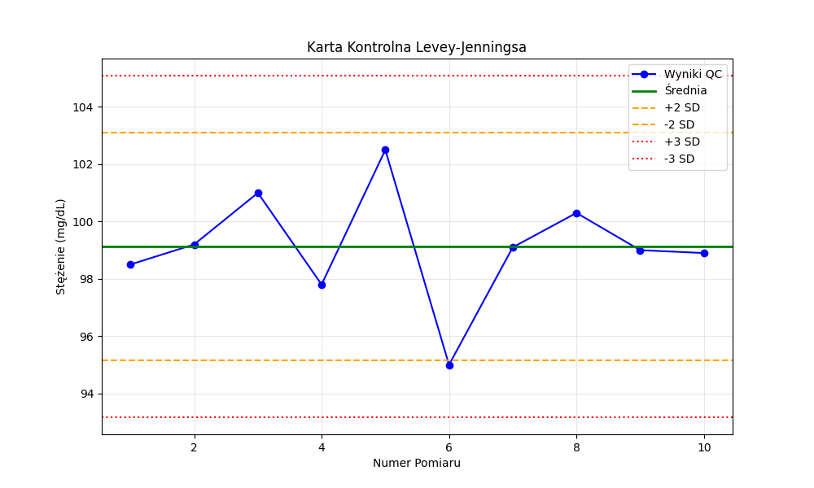

# 🛡️ Lab QC Guardian


> **Automated Quality Control Analyzer for Clinical Laboratories.**
> A Python tool that implements Westgard Rules logic and generates professional Levey-Jennings charts.

---

## 🤖 AI & Learning Transparency
**This project marks a significant step in my transition from Medical Analysis to Software Engineering (#FromPipetteToPython).**

While the domain knowledge (Laboratory Quality Control, Westgard Rules) comes from my 15 years of experience in diagnostics, the code architecture and Python implementation were developed with the active assistance of **Google Gemini**. I used AI as a technical mentor to overcome coding hurdles, optimize the statistical logic, and implement the visualization library.

---

## 📊 Overview
In laboratory medicine, **Quality Control (QC)** is the backbone of patient safety. This tool automates the daily routine of verifying analytical methods. Instead of manual spreadsheet calculations, it:
1.  Reads raw measurement data.
2.  Calculates key statistics (Mean, SD, CV%).
3.  Applies **Westgard Rules** to detect errors.
4.  Visualizes the trend on a control chart.

This project was built entirely on a mobile environment (**Samsung DeX** + **Pydroid 3**), proving that professional development can happen anywhere.

---

## ⚡ Key Features
* **📂 Automated Data Import:** Reads raw data from external `.txt` files (simulating LIMS export).
* **🧮 Statistical Engine:** Auto-calculates Mean, Standard Deviation (SD), and Coefficient of Variation (CV%).
* **🧠 Westgard Logic:** Automatically flags suspicious results:
    * ⚠️ **1-2s Rule:** Warning (result > 2 SD).
    * ❌ **1-3s Rule:** Critical Error (result > 3 SD).
* **📜 Audit Trail:** Appends every analysis result to a permanent log file (`dziennik_qc.txt`) with precise timestamps.
* **🎨 Data Visualization:** Generates a professional **Levey-Jennings Control Chart** (`.png`) using the Matplotlib library.

---

## 📸 Screenshots

### The Output Chart
The tool generates a PNG file allowing the diagnostician to visually assess the stability of the analytical method.


---

## 🚀 How to Run

### Prerequisites
You need Python 3 installed. This project uses `matplotlib` for graphing.

```bash
pip install matplotlib
```

## Usage Instructions

1. **Clone the repository:**
```bash
   git clone [https://github.com/MatthewJakubowski/Lab-QC-Guardian.git](https://github.com/MatthewJakubowski/Lab-QC-Guardian.git)
```
2. **Prepare your data:**
- ​Create a file named dane_qc.txt in the project folder.
- ​Input your control results (one numeric value per line).
3. **Run the analyzer:**
```bash
python main.py
```
4. **Check results:**
- ​View the console output for immediate Westgard analysis tables.
- ​Open wykres_qc.png to see the generated chart.
- ​Check dziennik_qc.txt for historical logs with timestamps.
----------------------------------------


## 👨‍🔬 About the Author


**Mateusz Jakubowski**
*Medical Analyst (15y exp) ➡️ Aspiring AI Engineer & Python Developer.*

I am building this project entirely on a mobile environment (**Samsung DeX** + **Pydroid 3**) to prove that you can engineer software anywhere.

* **Connect with me:** [LinkedIn](https://www.linkedin.com/in/mateuszjakubowski)
* **Follow my journey:** #FromPipetteToPython

---


## ⚠️ Medical & Legal Disclaimer

**Please read carefully before using this software:**

1.  **Educational Purpose Only:** This software (`Lab-QC-Guardian`) is intended **solely for educational, demonstration, and research purposes**. It is designed to illustrate the application of Python programming and Westgard Rules in laboratory diagnostics.
2.  **Not a Medical Device:** This tool is **NOT** a certified medical device (under MDR, IVDR, or FDA regulations) and has not undergone clinical validation. It should **NOT** be used as the primary or sole basis for accepting/rejecting analytical runs in a live clinical environment.
3.  **No Warranty:** The software is provided "AS IS", without warranty of any kind, express or implied. The author (Mateusz Jakubowski) makes no representations regarding the accuracy, reliability, or completeness of the calculations or charts generated.
4.  **User Responsibility:** Any use of this software in a laboratory setting is at the user's own risk. It is the responsibility of the qualified laboratory professional to verify all results against validated Laboratory Information Systems (LIS) and standard operating procedures.
