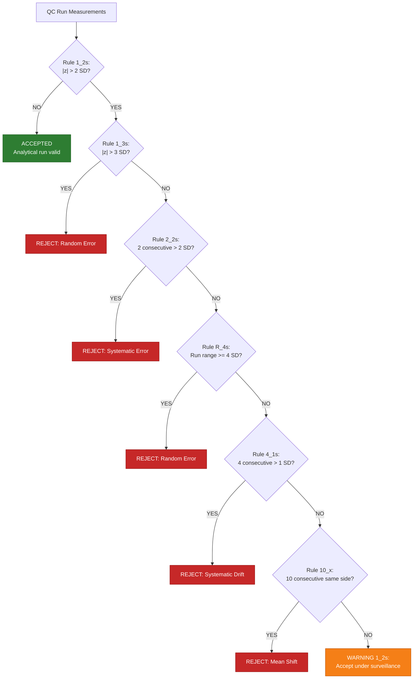

<div align="center">
  
</div>

# 🧪 Lab-QC-Guardian v2.0
### Statistical Quality Control & Metrology Engine for Clinical Laboratories


> **Automated Quality Control & Clinical Metrology Package.**  
> A fully interpretable, deterministic Statistical Quality Control (SQC) and metrology engine implementing a sliding-window Westgard multirule cascade, Six Sigma metrics, and publication-ready Levey-Jennings charts.

---

## 🤖 AI & Learning Transparency
**This project marks a significant milestone in my transition from Medical Diagnostic Analysis to Software Engineering and Explainable AI (#FromPipetteToPython).**

While the core domain knowledge (Laboratory Quality Control, Westgard Multirule algorithms, ISO 15189 compliance) stems from my 15 years of experience in clinical diagnostic laboratories, the modular v2.0 architecture, sliding-window logic, and unit test coverage were engineered with the technical co-pilot assistance of **Google Gemini**.

The entire codebase is developed and tested in a mobile-only engineering environment (**Samsung DeX** + **Pydroid 3** / **Termux**).

---

## 📊 Overview v2.0
In laboratory medicine, **Statistical Quality Control (SQC)** is the bedrock of analytical reliability and patient safety (**ISO 15189:2022**).

**Lab-QC-Guardian v2.0** refactors procedural script workflows into a modular, production-ready Python package (`lab_qc_guardian`) that:
1. **Handles Multi-Level QC:** Evaluates multiple control tiers concurrently (Level 1 Normal, Level 2 Pathological).
2. **Executes Full Westgard Multirule Cascade:** Evaluates random, systematic, and trend errors deterministically across a sliding window.
3. **Calculates Six Sigma Quality Metrics:** Computes the analytical $\sigma$ score to recommend optimal QC testing frequencies.
4. **Visualizes Analytical Trends:** Generates modern Levey-Jennings charts with automated violation flagging in dark/light themes.
5. **Guarantees Reliability:** Full unit test suite powered by `pytest`.

---

## ⚡ Implemented Westgard Multirules

| Rule | Error Type | Action Status | Analytical Interpretation |
| :--- | :--- | :--- | :--- |
| **$1_{2s}$** | Warning | Accept under surveillance | 1 QC result exceeds $\pm 2\,\text{SD}$. Triggers full cascade evaluation. |
| **$1_{3s}$** | Random Error | **Reject Run** | 1 QC result exceeds critical $\pm 3\,\text{SD}$ threshold. |
| **$2_{2s}$** | Systematic Error | **Reject Run** | 2 consecutive results (within level or across levels) exceed $2\,\text{SD}$ in the same direction. |
| **$R_{4s}$** | Random Error | **Reject Run** | The range between two control levels within a run or consecutive runs is $\ge 4\,\text{SD}$. |
| **$4_{1s}$** | Systematic Error / Drift | **Reject Run** | 4 consecutive results exceed $1\,\text{SD}$ on the same side of the mean. |
| **$10_{\bar{x}}$** | Mean Shift | **Reject Run** | 10 consecutive results fall on the same side of the target mean. |

---

## 🧠 Westgard Cascade Decision Tree


```mermaid
flowchart TD
    A["QC Run Measurements"] --> B{"Rule 1_2s:<br/>|z| > 2 SD?"}
    B -- NO --> C["ACCEPTED<br/>Analytical run valid"]
    B -- YES --> D{"Rule 1_3s:<br/>|z| > 3 SD?"}
    
    D -- YES --> E["REJECT: Random Error"]
    D -- NO --> F{"Rule 2_2s:<br/>2 consecutive > 2 SD?"}
    
    F -- YES --> G["REJECT: Systematic Error"]
    F -- NO --> H{"Rule R_4s:<br/>Run range >= 4 SD?"}
    
    H -- YES --> I["REJECT: Random Error"]
    H -- NO --> J{"Rule 4_1s:<br/>4 consecutive > 1 SD?"}
    
    J -- YES --> K["REJECT: Systematic Drift"]
    J -- NO --> L{"Rule 10_x:<br/>10 consecutive same side?"}
    
    L -- YES --> M["REJECT: Mean Shift"]
    L -- NO --> N["WARNING 1_2s:<br/>Accept under surveillance"]

    style C fill:#2e7d32,stroke:#1b5e20,color:#fff
    style N fill:#f57f17,stroke:#bc5100,color:#fff
    style E fill:#c62828,stroke:#8e0000,color:#fff
    style G fill:#c62828,stroke:#8e0000,color:#fff
    style I fill:#c62828,stroke:#8e0000,color:#fff
    style K fill:#c62828,stroke:#8e0000,color:#fff
    style M fill:#c62828,stroke:#8e0000,color:#fff
```
​## 📐 Six Sigma Metrology

The Six Sigma ($\sigma$) metric provides an objective, quantitative framework for evaluating analytical method performance in clinical diagnostic laboratories (**ISO 15189:2022**). It enables precise design of Westgard multirule Quality Control (QC) strategies and optimizes QC measurement frequency based on the intrinsic stability of the analytical process.

---

### 🧮 Mathematical Sigma Formulation

The Six Sigma quality metric evaluates analytical performance by comparing tolerance limits against total method error:

$$
\text{Sigma } (\sigma) = \frac{\text{TEa} - |\text{Bias}|}{\text{CV}}
$$

$$
\text{Bias} = \frac{\bar{x} - \mu}{\mu} \times 100
$$

$$
\text{CV} = \frac{\text{SD}}{\bar{x}} \times 100
$$

**Parameters Definition:**
* **TEa** (*Total Allowable Error*): Maximum permissible analytical error (CLIA / EFLM / RiliBÄK).
* **Bias** (*Systematic Error*): Relative trueness deviation from target reference value ($\mu$).
* **CV** (*Coefficient of Variation*): Relative analytical imprecision derived from observed mean ($\bar{x}$) and standard deviation ($\text{SD}$).

---

### 📊 Quality Tiers & Recommended Westgard QC Protocols

| Sigma Metric ($\sigma$) | Quality Tier | Process Performance | Recommended Westgard QC Protocol |
| :--- | :--- | :--- | :--- |
| **>= 6.0 $\sigma$** | **World Class** | Exceptional precision and negligible systematic bias | Single 1_3s rule (1 QC run per analytical batch) |
| **5.0 - 5.9 $\sigma$** | **Excellent** | High analytical stability | 1_3s / 2_2s / R_4s cascade (1–2 QC runs per batch) |
| **4.0 - 4.9 $\sigma$** | **Good** | Standard routine clinical performance | Full cascade: 1_3s / 2_2s / R_4s / 4_1s (2 QC runs per batch) |
| **3.0 - 3.9 $\sigma$** | **Marginal** | Elevated analytical error risk | Full multirule cascade + increased QC frequency (4 QC runs per batch) |
| **< 3.0 $\sigma$** | **Unacceptable** | Fails clinical quality specifications | **Halt patient testing**, recalibrate, perform root-cause audit |

---

## 🏗️ Repository Architecture

```text
Lab-QC-Guardian/
├── lab_qc_guardian/
│   ├── __init__.py       # Package public interface exports
│   ├── engine.py         # Deterministic Westgard sliding-window engine
│   ├── metrics.py        # Metrology engine & Six Sigma calculator
│   └── visualizer.py     # Levey-Jennings chart generator
├── tests/
│   └── test_westgard.py  # Comprehensive pytest test suite
├── main.py               # Demonstration runner script
├── requirements.txt      # Project dependencies
└── README.md
```
### 🚀 Quick Start
## ​1. Installation
```bash
git clone [https://github.com/MatthewJakubowski/Lab-QC-Guardian.git](https://github.com/MatthewJakubowski/Lab-QC-Guardian.git)
cd Lab-QC-Guardian
pip install -r requirements.txt
```
## 2. Run Test Suite
```bash
pytest tests/ -v
```
## 3. Run Demonstration
```bash
python main.py
```
## 💡 Code Example
```python
from lab_qc_guardian import ControlTarget, WestgardEngine, MetrologyEngine

# 1. Define target parameters for QC levels
targets = {
    "Level 1 (Normal)": ControlTarget(level="Level 1 (Normal)", target_mean=100.0, target_sd=2.0),
    "Level 2 (Pathological)": ControlTarget(level="Level 2 (Pathological)", target_mean=200.0, target_sd=4.0),
}

engine = WestgardEngine(targets=targets, window_size=15)

# 2. Evaluate a multi-level QC run
result = engine.evaluate_run({
    "Level 1 (Normal)": 104.5,         # +2.25 SD (Triggers 1_2s warning)
    "Level 2 (Pathological)": 200.5,   # +0.12 SD (In control)
})

print(f"Run Status: {result.status.value}")
for v in result.violations:
    print(f"Alert: [{v.rule_name}] -> {v.description}")
```
## 🛡️ Zero Black-Box XAI Manifesto

In clinical diagnostics and metrology, uninterpretable "black-box" systems introduce unacceptable operational and patient risk. Every rejection alert and surveillance warning in **Lab-QC-Guardian** is mathematically determinable, traceable, and fully interpretable by clinical laboratory professionals.

---

## 👨‍🔬 About the Author


**Mateusz (Matthew) Jakubowski**  
*Senior Laboratory Technologist (15y experience in Clinical Diagnostics) ➡️ Aspiring AI Engineer & Python Developer*

* **Portfolio Showroom:** [mateusz-jakubowski.ai.studio](https://mateusz-jakubowski.ai.studio/)
* **Project Hub:** [from-pipette-to-python.ai.studio](https://from-pipette-to-python.ai.studio/)
* **GitHub:** [@MatthewJakubowski](https://github.com/MatthewJakubowski)
* **LinkedIn:** [mateuszjakubowski](https://www.linkedin.com/in/mateuszjakubowski)
* **Hugging Face:** [@matthewjakubowski](https://huggingface.co/matthewjakubowski)
* **Kaggle:** [@matthewjakubowski](https://www.kaggle.com/matthewjakubowski)
* **X (Twitter):** [@M_S_Jakubowski](https://x.com/M_S_Jakubowski)
* **Vivino Profile:** [mateusz.jakubowski](http://www.vivino.com/users/mateusz.jakubowski/)

---

## ⚠️ Medical & Legal Disclaimer

1. **Educational Purpose Only:** This software (`Lab-QC-Guardian`) is intended solely for educational, demonstration, and research purposes.
2. **Not a Medical Device:** This tool is **NOT** a certified medical device (under MDR, IVDR, or FDA regulations) and has not undergone clinical validation. It must not be used as the sole basis for accepting or rejecting analytical runs in clinical patient testing.
3. **No Warranty:** The software is provided "AS IS", without warranty of any kind, express or implied.
4. **User Responsibility:** Qualified laboratory professionals are responsible for validating all analytical outputs against standard operating procedures and accredited Laboratory Information Systems (LIS) under ISO 15189.


